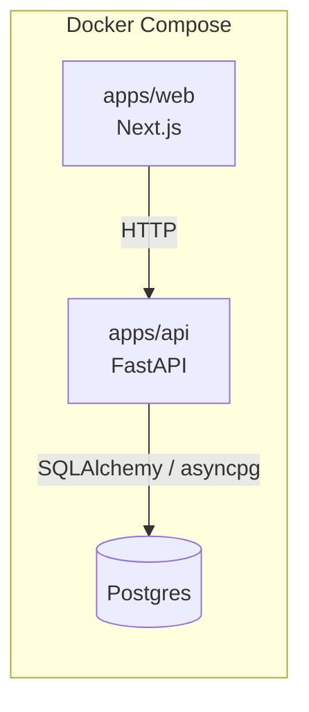
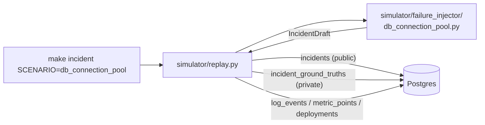

# Architecture

This document describes the system as it exists today. It grows with each
implementation phase (see `docs/IMPLEMENTATION_STATUS.md`) rather than
describing the full target design up front.

## Phase 1: Foundation

- **`apps/web`** — Next.js (App Router, TypeScript). Currently a single page
  that calls the API's `/health` endpoint to prove end-to-end wiring.
- **`apps/api`** — FastAPI. Exposes:
  - `GET /health` — liveness only, no dependencies checked.
  - `GET /health/ready` — readiness; opens a real connection to Postgres and
    returns `503` if it can't.
- **Postgres** — schema now exists (see Phase 2 below), owned by `core/`.
- **`core/config.py`** — Pydantic Settings, reads from environment
  variables / `.env`. `.env.example` documents every variable in use.

Nothing in this phase talks to an LLM or a vector store — those are
introduced in later phases as the `docs/IMPLEMENTATION_STATUS.md` tracker
is updated.

## Phase 2: Incident Simulator

- **`core/models.py`** — the shared ORM schema, deliberately split so
  ground truth can never leak into an investigator-facing query:
  - `incidents` — service, severity, description, start/end time. This is
    the only table any future agent/tool is allowed to read.
  - `incident_ground_truths` — root cause, affected component, trigger,
    and the scenario_id that generated it. Evaluation-only (spec §8, §18).
    A separate table, not columns on `incidents`, specifically so a normal
    query against `incidents` can't accidentally join it in.
  - `log_events` / `metric_points` / `deployments` — raw telemetry, each
    row tagged `is_distractor` for the Phase 6 evaluation harness. **Any
    Phase 3+ tool that exposes these rows to an agent must strip
    `is_distractor`** — leaving it in would hand the agent the answer.
- **`simulator/failure_injector/`** — one class per scenario. Given an
  `anchor_time`, deterministically generates the full `IncidentDraft`
  (timeline, logs, metrics, deployments, ground truth) — no randomness, no
  real service under load (see `docs/design-decisions.md` DDR-007). The
  first scenario, `db_connection_pool`, reproduces spec §8's worked
  example: a deploy shrinks a connection pool, the pool saturates, error
  rate and latency spike, plus a few unrelated distractor events (a Redis
  warning, an unrelated deploy, a CPU blip on another service).
- **`simulator/scenarios/`** — the scenario_id → injector registry
  (`get_injector`).
- **`simulator/replay.py`** — `run_scenario(scenario_id)`: resolves the
  injector, creates the schema if missing, assigns the next sequential
  `INC-XXXX` id, and persists everything in one transaction. `main()`
  wraps it as the `make incident SCENARIO=<id>` CLI.
- **Schema creation** — still `Base.metadata.create_all()`, not Alembic
  (DDR-004 extended: still true, the schema is still young enough that
  migrations would just be churn).

Nothing yet *exposes* this telemetry to an agent as scored, provenanced
evidence — that abstraction (spec §9's Evidence model, `relevance`,
`evidence_id`) is Phase 3.
