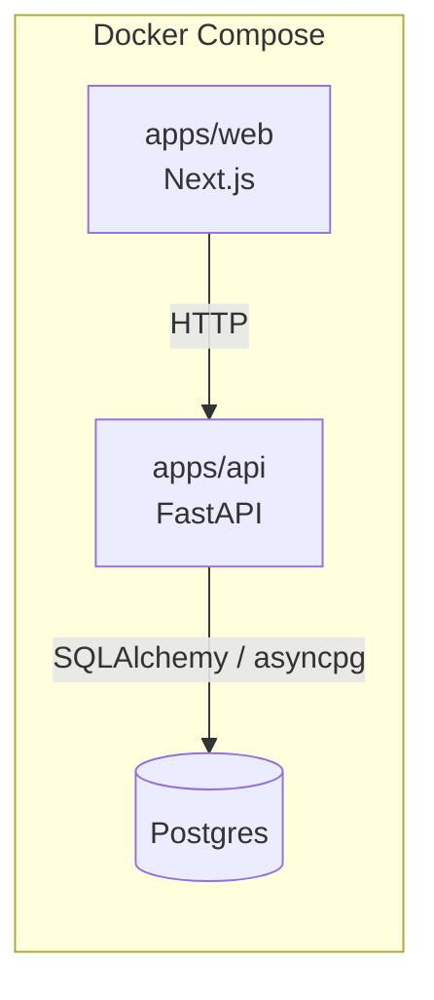

# Architecture

This document describes the system as it exists today. It grows with each
implementation phase (see `docs/IMPLEMENTATION_STATUS.md`) rather than
describing the full target design up front.

## Phase 1: Foundation

- **`apps/web`** — Next.js (App Router, TypeScript). Currently a single page
  that calls the API's `/health` endpoint to prove end-to-end wiring.
- **`apps/api`** — FastAPI. Exposes:
  - `GET /health` — liveness only, no dependencies checked.
  - `GET /health/ready` — readiness; opens a real connection to Postgres and
    returns `503` if it can't.
- **Postgres** — no schema yet. It exists at this phase purely to prove the
  three services can be composed and start healthy together. The incident /
  evidence schema arrives in Phase 3 (Evidence Layer).
- **Configuration** — `apps/api/dependencies/config.py` (Pydantic Settings)
  reads from environment variables / `.env`. `.env.example` documents every
  variable Phase 1 uses.

Nothing in this phase talks to an LLM, a vector store, or the incident
simulator — those are introduced in later phases as the
`docs/IMPLEMENTATION_STATUS.md` tracker is updated.
