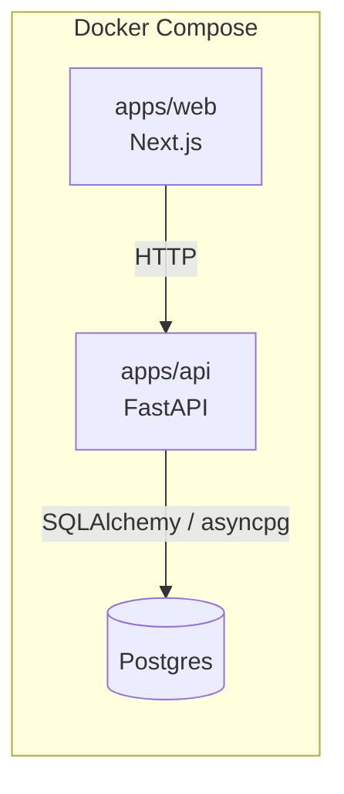
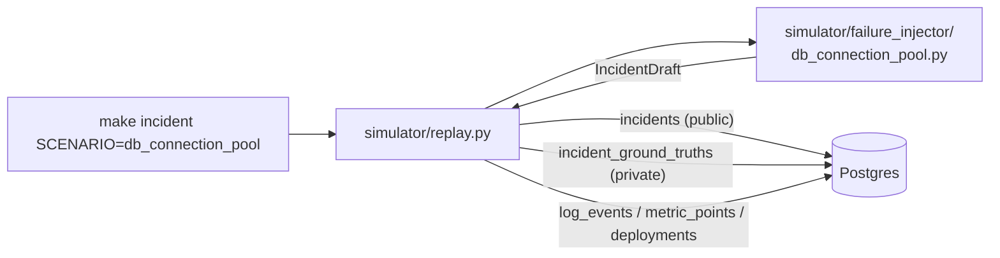
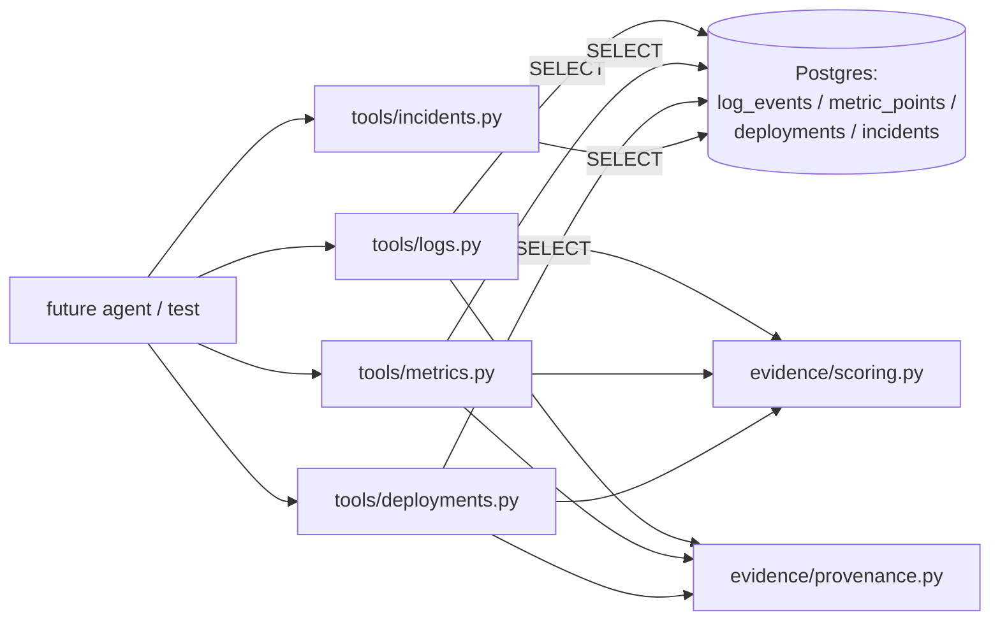
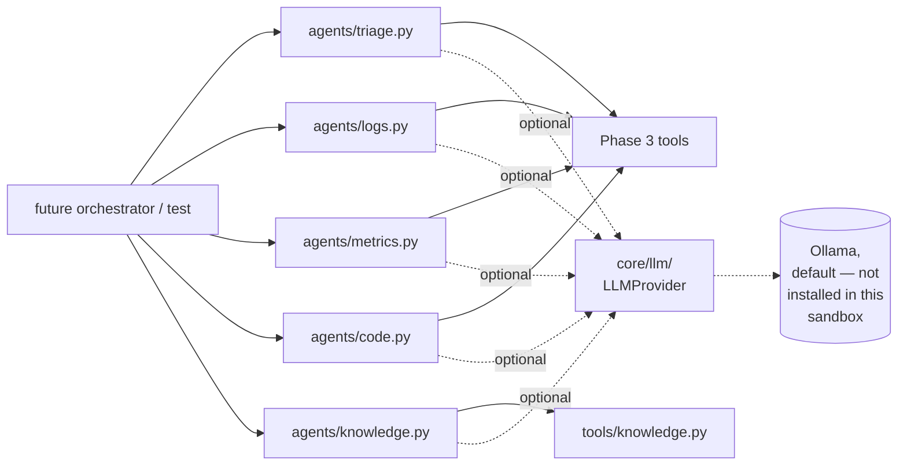
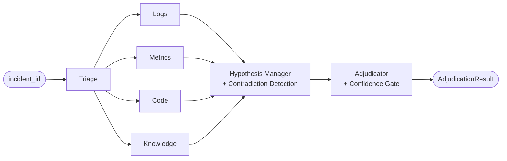
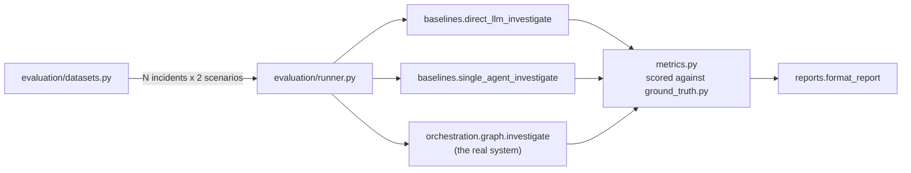
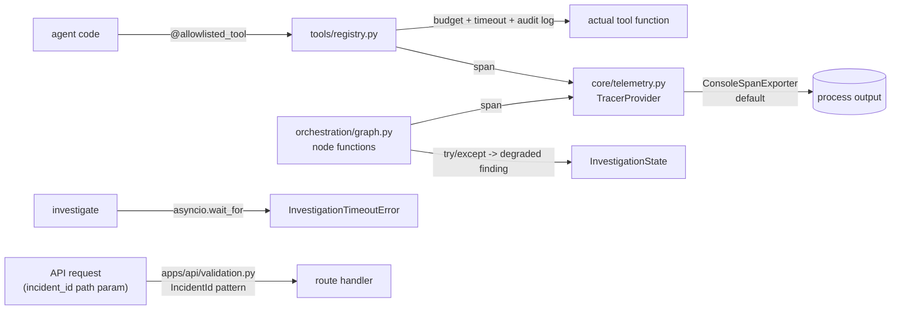
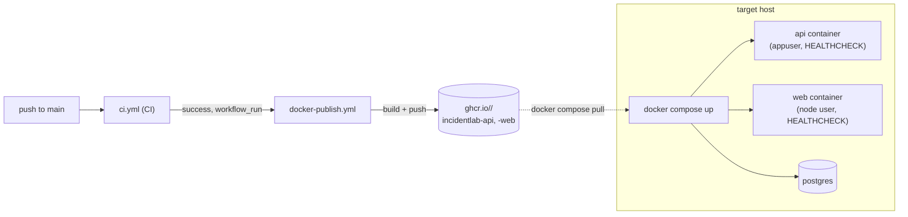

# Architecture

This document describes the system as it exists today. It grows with each
implementation phase (see `docs/IMPLEMENTATION_STATUS.md`) rather than
describing the full target design up front.

## Phase 1: Foundation



- **`apps/web`** — Next.js (App Router, TypeScript). Currently a single page
  that calls the API's `/health` endpoint to prove end-to-end wiring.
- **`apps/api`** — FastAPI. Exposes:
  - `GET /health` — liveness only, no dependencies checked.
  - `GET /health/ready` — readiness; opens a real connection to Postgres and
    returns `503` if it can't.
- **Postgres** — schema now exists (see Phase 2 below), owned by `core/`.
- **`core/config.py`** — Pydantic Settings, reads from environment
  variables / `.env`. `.env.example` documents every variable in use.

Nothing in this phase talks to an LLM or a vector store — those are
introduced in later phases as the `docs/IMPLEMENTATION_STATUS.md` tracker
is updated.

## Phase 2: Incident Simulator



- **`core/models.py`** — the shared ORM schema, deliberately split so
  ground truth can never leak into an investigator-facing query:
  - `incidents` — service, severity, description, start/end time. This is
    the only table any future agent/tool is allowed to read.
  - `incident_ground_truths` — root cause, affected component, trigger,
    and the scenario_id that generated it. Evaluation-only (spec §8, §18).
    A separate table, not columns on `incidents`, specifically so a normal
    query against `incidents` can't accidentally join it in.
  - `log_events` / `metric_points` / `deployments` — raw telemetry, each
    row tagged `is_distractor` for the Phase 6 evaluation harness. **Any
    Phase 3+ tool that exposes these rows to an agent must strip
    `is_distractor`** — leaving it in would hand the agent the answer.
- **`simulator/failure_injector/`** — one class per scenario. Given an
  `anchor_time`, deterministically generates the full `IncidentDraft`
  (timeline, logs, metrics, deployments, ground truth) — no randomness, no
  real service under load (see `docs/design-decisions.md` DDR-007). The
  first scenario, `db_connection_pool`, reproduces spec §8's worked
  example: a deploy shrinks a connection pool, the pool saturates, error
  rate and latency spike, plus a few unrelated distractor events (a Redis
  warning, an unrelated deploy, a CPU blip on another service).
- **`simulator/scenarios/`** — the scenario_id → injector registry
  (`get_injector`).
- **`simulator/replay.py`** — `run_scenario(scenario_id)`: resolves the
  injector, creates the schema if missing, assigns the next sequential
  `INC-XXXX` id, and persists everything in one transaction. `main()`
  wraps it as the `make incident SCENARIO=<id>` CLI.
- **Schema creation** — still `Base.metadata.create_all()`, not Alembic
  (DDR-004 extended: still true, the schema is still young enough that
  migrations would just be churn).

Nothing yet *exposes* this telemetry to an agent as scored, provenanced
evidence — that abstraction (spec §9's Evidence model, `relevance`,
`evidence_id`) is Phase 3.

## Phase 3: Evidence Layer



- **`evidence/models.py`** — `Evidence` (evidence_id, source_type, source,
  timestamp, content, relevance, provenance) and `SourceType` (spec §9's
  full enum, though only `log`/`metric`/`deployment` are produced so far —
  see DDR-008). `Evidence` has no `is_distractor` field by construction:
  a tool physically cannot leak it through this model, not just by
  convention.
- **`evidence/provenance.py`** — `build_evidence_id` (the `LOG-1842` /
  `METRIC-203` / `DEPLOY-482` format from spec §9's example) and
  `build_provenance` (which table/row this came from, when it was
  fetched).
- **`evidence/scoring.py`** — `temporal_relevance`: 1.0 inside the
  incident's `[start_time, end_time]`, decaying the further outside it a
  timestamp falls (floor 0.2). A documented experimental baseline (spec
  §16), not a calibrated model — the point is that it's deterministic and
  reproducible, not that the decay curve is "correct". `matches_query`:
  case-insensitive substring filter.
- **`tools/incidents.py`** — `get_incident` (the public `IncidentPublic`
  model — service/severity/description/start/end, structurally incapable
  of carrying ground truth) and `get_incident_timeline` (every log/metric/
  deployment Evidence in the window, chronologically merged).
- **`tools/logs.py`** — `search_logs` (optionally filtered by substring)
  and `find_error_spikes` (minute-bucketed error counts ≥3 — a derived
  aggregate over several rows, so it's a separate `LogSpike` model, not
  forced into the single-row-backed `Evidence` shape).
- **`tools/metrics.py`** — `query_metrics` and `detect_anomaly` (a fixed,
  documented per-metric threshold table — e.g. `error_rate > 0.05`,
  `db_connections_active >= 5`). `compare_baseline` (spec §12) is *not*
  implemented: it needs a genuine pre-incident "normal" window the
  simulator doesn't generate, and fabricating one would violate "never
  invent evidence" (spec §4.3).
- **`tools/deployments.py`** — `get_recent_deployments`, across every
  service in the window (not just the affected one — an unrelated
  service's deploy is exactly the kind of distractor an agent needs to
  see and correctly discount, not have pre-filtered away).

All four tool modules search a padded window
(`evidence.scoring.SEARCH_WINDOW_PADDING`, 15 minutes either side of
`[start_time, end_time]`) rather than the exact incident window, so a
precursor deployment a few minutes before `start_time` is still found.

Not yet built: `tools/github.py`, `tools/traces.py` (DDR-008 — no real
commit/PR data or tracing backend exists yet), `evidence/graph.py`
(DDR-009 — no consumer until the Phase 7 UI). Nothing here is wrapped as
an LLM-callable tool yet either — these are plain typed async functions;
Phase 4 wires them into agents.

## Phase 4: Agents



- **`core/llm/`** — spec §44's model abstraction. `LLMProvider` (ABC,
  `generate(prompt, system=None) -> str`) with three implementations —
  `OllamaProvider` (default), `OpenAICompatibleProvider`,
  `AnthropicCompatibleProvider` — all raising the single
  `LLMUnavailableError` on any failure, so callers never need to know
  which HTTP shape or client failed underneath. `core/llm/factory.py`'s
  `get_llm_provider()` reads `core.config.Settings` (`llm_provider`,
  `llm_model`, `llm_base_url`, `llm_api_key`). No live LLM exists in this
  sandbox (no Ollama, no API access), so every provider is tested via
  `httpx.MockTransport` — real request/response shape verified, zero
  network dependency.
- **`agents/base.py`** — the two pieces of logic shared by every agent:
  `hypotheses_from_content` (a small, deliberately non-exhaustive keyword
  → hypothesis-text pattern table — grows as `simulator/failure_injector/`
  grows more scenarios) and `summarize_or_fallback` (try the LLM, degrade
  to a deterministic fallback on absence or failure — never blocks, never
  fabricates). See DDR-010 for why an agent's structured output never
  depends on the LLM being reachable, only its prose `summary` does.
- **`agents/models.py`** — `TriageFinding` (spec §10's shape) and
  `InvestigatorFinding` (spec §11's shared shape for the other four
  agents).
- **`agents/triage.py`** — affected services, time window, investigation
  targets (every service actually seen in the window — including
  distractor services, deliberately: the agent isn't told which are
  real), and evidence-grounded initial hypotheses from nearby
  deployments. No `get_service_metadata()` — no service registry exists
  to back one.
- **`agents/logs.py` / `agents/metrics.py`** — thin wrappers over the
  Phase 3 tools, turning spikes/anomalies into structured `findings`.
- **`agents/code.py`** — reuses `tools.deployments.get_recent_deployments`
  rather than a new git-backed tool (DDR-011): a deployment record already
  carries a commit_sha and change description.
- **`agents/knowledge.py`** — searches the new `knowledge/` corpus (three
  real markdown documents: a runbook, an architecture note, one
  clearly-labeled synthetic historical incident) via
  `tools/knowledge.py`'s keyword search (DDR-012 — no Qdrant/embeddings
  yet, and at this corpus size a vector store would be pure overhead).

Every agent's `investigate(incident_id, llm=None)` is independently
callable and independently tested against a real seeded incident — there
is no orchestrator wiring them together yet (that's Phase 5), and none of
this is wrapped as an LLM-callable tool with allowlisting/timeouts (that's
Phase 8's security hardening, spec §39).

## Phase 5: Orchestration



- **`orchestration/state.py`** — `InvestigationState`, a `TypedDict` shared
  across every node. Each investigator node writes its own distinct key
  (`logs_finding`, `metrics_finding`, ...), so the four run genuinely in
  parallel with no reducer needed — LangGraph's default per-key
  last-write-wins is exactly correct when only one node ever writes each
  key.
- **`orchestration/graph.py`** — builds the actual `langgraph.StateGraph`:
  Triage fans out to the four investigators, they fan back in to the
  Hypothesis Manager (a plain node function, not an LLM call), then the
  Adjudicator, then `END`. `investigate(incident_id, llm=None)` is the
  public entrypoint (`await app.ainvoke(...)`); `main()` wraps it as the
  `make investigate INCIDENT=<id>` CLI, which by default tries to
  construct a real `LLMProvider` from `core.config.Settings` (Ollama, per
  spec §6's default) and gracefully degrades per-agent if it's
  unreachable — `--no-llm` skips the attempt entirely. See DDR-014 for
  why this graph is single-pass (no loop-back to re-investigate on low
  confidence).
- **`hypotheses/manager.py`** — spec §15's Hypothesis Manager. Merges
  `HypothesisSignal`s from Logs/Metrics/Code into competing `Hypothesis`
  objects, using a small canonical-grouping table (DDR-013) so signals
  from different agents describing the same root cause combine into one
  multi-source hypothesis instead of staying separately weaker. Knowledge
  doesn't feed this — see DDR-015.
- **`hypotheses/contradiction.py`** — spec §17's Contradiction Detector:
  for a hypothesis expecting corroboration from a specific metric, if
  that metric was measured but didn't cross its anomaly threshold, the
  measured point becomes contradicting evidence. Reuses the same
  canonical table (DDR-013).
- **`hypotheses/scoring.py`** — spec §16's deterministic confidence
  formula: weighted evidence coverage + source diversity + temporal
  alignment − contradiction penalty, clamped to [0, 1]. An explicit,
  documented experimental baseline, not a calibrated model.
- **`agents/adjudicator.py`** — spec §18's Adjudicator: picks the
  highest-confidence `Hypothesis`, attaches corroborating Knowledge
  evidence to the winner only (DDR-015), and recommends an action by
  citing a matching runbook if one was found among the evidence — never a
  fabricated remediation step (spec §4.3).
- **`orchestration/routing.py`** — spec §19's confidence gate
  (`gate_confidence`, `needs_human_review`), thresholds read from
  `core.config.Settings` (`confidence_strong_threshold`,
  `confidence_review_threshold` — configurable per spec §19's own
  instruction, not hardcoded).

Verified end to end with `make investigate INCIDENT=INC-0001`: selects
"Connection pool exhaustion" at 93% confidence, `needs_human_review:
False`, zero contradictions, and cites the real runbook as the
recommended action — all without any LLM actually running, since none is
reachable in this sandbox (confirmed: Ollama connection attempts fail
fast and every agent degrades to its deterministic fallback, ~2 seconds
end to end for the whole graph).

A second scenario, `simulator/failure_injector/redis_unavailable.py`
(spec §23 Scenario 2), was added before Phase 6 specifically so there'd
be two distinguishable root causes to evaluate against — see DDR-016. It
reuses every piece of this architecture unchanged (same tools, same
agents, same Hypothesis Manager, same Adjudicator) and genuinely
exercises the Contradiction Detector: its elevated latency alone would
suggest "connectivity issue" via the same canonical grouping as the DB
scenario, but the confirmed-normal `error_rate` reading contradicts it,
correctly dropping that hypothesis's confidence from 0.93 to 0.17.

## Phase 6: Evaluation



- **`evaluation/ground_truth.py`** — the *only* module (besides the
  simulator itself) allowed to read `IncidentGroundTruthRecord` or the
  `is_distractor` flag. Holds `_ROOT_CAUSE_TO_HYPOTHESIS`, the one place
  ground truth's enum values and the investigator's free-text hypothesis
  vocabulary are allowed to touch (spec §8, §18).
- **`evaluation/baselines.py`** — spec §27's two non-multi-agent
  architectures:
  - `direct_llm_investigate` — the incident's public summary straight to
    an LLM, zero tools, zero evidence. Confidence is structurally fixed
    at `0.0` regardless of what the LLM says (DDR-018) — never the LLM's
    own guess, and it forces `needs_human_review: True` every time, which
    is the honest behavior for a genuinely evidence-free guess.
  - `single_agent_investigate` — one agent, every tool, reusing the real
    agents' keyword patterns and anomaly thresholds (so it isn't a
    strawman with worse *data*) but with none of the Hypothesis Manager's
    sophistication: no cross-source merging, no contradiction detection,
    confidence is a single crude ratio. This is deliberately what
    "multi-agent" is measured against.
  - `multi_agent` isn't a separate function — the benchmark calls
    `orchestration.graph.investigate` directly, the exact same code path
    `make investigate` uses.
- **`evaluation/metrics.py`** — spec §27's metrics as pure functions over
  a `Trial` (one architecture's result + the matching ground truth):
  root cause accuracy, evidence recall/precision (against the incident's
  real non-distractor evidence_ids), unsupported-claim rate, false-
  confidence rate, human escalation rate, latency. `aggregate()` averages
  a list of `Trial`s into one architecture's row.
- **`evaluation/datasets.py`** — generates the benchmark dataset fresh
  each run (DDR-017: 2 scenarios × 3 instances by default, honestly
  disclosed as structurally-repeated instances, not spec §29's "5
  variations").
- **`evaluation/runner.py`** — runs all three architectures against the
  same dataset, scores each, returns a `BenchmarkReport`.
- **`evaluation/reports.py`** — spec §29's table format (one table per
  metric, architectures as rows) plus the `make benchmark` CLI.

Verified with `make benchmark` (6 incidents, no LLM — this sandbox has
none): Direct LLM scores 0% on everything and 100% human escalation, the
real and disclosed consequence of having no evidence and no reachable
model, not a harness bug. Single Agent and Multi-Agent both reach 100%
root cause accuracy on this small dataset, but Multi-Agent shows higher
evidence recall (78% vs 72% — the cross-source evidence merging helps)
at a small precision cost (81% vs 82%) and higher latency (0.05s vs
0.02s, pure orchestration overhead with no LLM in the loop) — a genuine,
non-rigged finding for this dataset size, not an assumed conclusion (spec
§3: "do not assume the answer").

## Phase 7: UI

```mermaid
flowchart LR
    web["apps/web (Next.js)"] -->|fetch, browser-side| api[apps/api routes]
    api --> incidents_r["incidents.py<br/>list/get/create"]
    api --> inv_r["investigations.py<br/>investigate/approve/reject"]
    api --> eval_r["evaluations.py<br/>run/list/get"]
    inv_r --> graph[orchestration.graph.investigate]
    eval_r --> runner[evaluation.runner.run_benchmark]
```

- **`apps/api/routes/incidents.py`** — `GET /incidents`, `GET
  /incidents/{id}`, `POST /incidents` (runs a scenario — the web UI's
  "Generate Incident" control), `GET /scenarios` (not in spec §38's
  literal list; the UI needs it to populate that control).
- **`apps/api/routes/investigations.py`** — `POST
  /incidents/{id}/investigate` plus `GET /investigations/{id}` and its
  `/timeline`, `/evidence`, `/hypotheses`, `/agents` sub-resources, and
  `POST .../approve` / `.../reject`. None of this is persisted — see
  DDR-019 (why recomputing is simpler and can't go stale) and DDR-021
  (why approve/reject say plainly, in the response itself, that they're
  acknowledgment-only).
- **`apps/api/routes/evaluations.py`** — `GET /evaluations`, `POST
  /evaluations/run`, `GET /evaluations/{id}`, backed by an in-memory
  dict (DDR-020 — not Postgres; this is dev/demo tooling, not an audit
  trail).
- **`apps/api/main.py`** gained a `lifespan` hook that creates the schema
  at startup — fixing a real bug that no route previously guaranteed
  (`docs/design-decisions.md`'s closing section, "Bug found by manually
  testing the UI in a browser").
- **`apps/web`** — three pages, all client components fetching the API
  directly (`lib/api.ts`, typed against `lib/types.ts`, hand-written to
  match the Pydantic response models field-for-field):
  - `/` — incident dashboard: generate an incident from a scenario, list
    existing ones, link into each.
  - `/incidents/[id]` — the investigation console: incident header, a
    "Run Investigation" action (with an optional "use LLM" toggle),
    then Agent Activity (one card per agent), Hypotheses (confidence
    bars), and the RCA panel (selected hypothesis, reasoning, supporting/
    contradicting evidence, recommended action, Approve/Reject). Evidence
    is a grouped, linked list rather than an interactive graph — DDR-022
    on why that's a deliberate scope cut, not an oversight.
  - `/evaluation` — runs the Phase 6 benchmark and renders spec §29's
    table format in the browser.
  - Dark, technical styling (`app/globals.css`) — spec §31's own
    direction ("an SRE investigation console, not a chatbot").

Verified by actually running both dev servers and driving the UI with a
real headless browser (Playwright), not just `npm run build` — screens
captured at each step of generate → investigate → review → benchmark.
That's what caught both bugs `docs/design-decisions.md` closes with;
neither showed up in `npm run build`, `pytest`, or a code read.

## Phase 8: Security + Observability



- **`tools/registry.py`** — spec §38-40's tool permission layer, applied
  as one decorator (`@allowlisted_tool("name")`) to all ten tool functions
  rather than four separate mechanisms (DDR-023): a live allowlist
  (`allowed_tools()`, `call_tool()` dispatch raising `ToolNotAllowed` for
  an unregistered name), a per-call `asyncio.wait_for(...,
  Settings.tool_timeout_seconds)`, a shared per-investigation call budget
  (`Settings.max_tool_calls_per_investigation`, default 100 — a real
  investigation measures 38 calls end to end), and a structured
  `structlog` audit log line plus an OpenTelemetry span on every call.
  The budget is shared across LangGraph's parallel investigator nodes via
  a mutable single-element list behind a `ContextVar` (DDR-023 explains
  why a plain int wouldn't work). `reset_tool_budget()` is called once,
  by `orchestration.graph.investigate()` — a tool called outside a real
  investigation is deliberately unbudgeted.
- **`core/telemetry.py`** — spec §42's structured traces. Owns a private
  `TracerProvider` directly rather than going through
  `opentelemetry.trace`'s global (once-only) API (DDR-026), defaulting to
  a `ConsoleSpanExporter` — spans are real and inspectable in process
  output, but no OTel collector is stood up (same reasoning as never
  standing up Qdrant — DDR-012 — nothing in this project's infra exists
  for one to be verified against here). `tools/registry.py` and
  `orchestration/graph.py` both open spans carrying spec §42's listed
  attributes (`incident_id`, `agent_name`/`tool`, duration, outcome).
- **`orchestration/graph.py`** — graceful degradation (DDR-024, spec
  §43's own worked example): every node catches its agent's exceptions
  and returns a `degraded=True` finding (`agents/models.py`'s new field)
  instead of crashing the whole graph — except a nonexistent
  `incident_id` (`ValueError`), which still fails the whole investigation
  since every agent would fail identically. `investigate()` also enforces
  `Settings.investigation_timeout_seconds` as an overall ceiling
  (`InvestigationTimeoutError`, mapped to HTTP 504), on top of each tool
  call's own timeout.
- **`agents/base.py`** — `format_evidence_for_prompt()`, spec §41's
  prompt-injection defense in depth (DDR-025) on top of the structural
  guarantee DDR-010 already provides: every agent's LLM prompt wraps
  evidence content in an explicit `<evidence label="...">` block with a
  preamble stating it's untrusted data, never instructions.
- **`apps/api/validation.py`** — `IncidentId`, a FastAPI `Path` type
  constraining every route's `incident_id` parameter to this project's
  own `INC-<n>` shape (DDR-027) — found and fixed a real bug where a null
  byte reached asyncpg raw and came back as an uncaught 500.
  `apps/api/routes/evaluations.py`'s `RunEvaluationRequest.
  instances_per_scenario` is similarly capped at 20 — spec §41's
  "oversized requests" in practice (each instance runs three
  architectures' worth of real investigations).

Verified with `tests/integration/test_orchestration_resilience.py`
(monkeypatching real agent functions to raise, confirming the rest of the
investigation still completes) and `tests/integration/test_api_security.py`
(SQL-injection-shaped, null-byte, oversized, and malformed inputs against
the real API — all reach a clean 4xx, never a 500), plus
`tests/unit/test_tools_registry.py`, `test_prompt_injection_defense.py`,
and `test_telemetry.py`. Measured directly, not assumed: a real
`db_connection_pool` investigation makes 38 tool calls end to end with no
LLM configured.

## Phase 9: Deployment



- **`core/config.py` / `apps/api/main.py`** — CORS origins are now
  `Settings.cors_allowed_origins` (configurable, comma-separated),
  replacing Phase 1's hardcoded `http://localhost:3000` (DDR-028) — the
  concrete bug this phase's own scoping work found: any deployment on a
  real domain would have silently had every browser request blocked with
  no server-side error to point at.
- **`apps/api/Dockerfile` / `apps/web/Dockerfile`** — both now run as an
  unprivileged user (`appuser` / the Node image's built-in `node` user)
  and declare their own `HEALTHCHECK`, not just relying on
  `docker-compose.yml`'s (DDR-029) — correct under any runtime that reads
  an image's health signal, not only Compose.
- **`docker-compose.yml`** — `restart: unless-stopped` on all three
  services; `CORS_ALLOWED_ORIGINS` threaded through to the `api` service.
- **`.dockerignore`** (existed since Phase 1, extended this phase) —
  keeps `.git`, `__pycache__`, `node_modules`, `.env`, and friends out of
  the build context both Dockerfiles share (`context: .`).
- **`.github/workflows/docker-publish.yml`** — builds and pushes both
  images to GHCR, gated on `ci.yml` succeeding on `main` (DDR-030), so a
  red `main` never gets published as a good build. Cannot be executed
  inside the sandbox this project is built in (no GitHub Actions runner
  here) — correct by construction against well-established
  `docker/build-push-action` patterns, not by a completed run.
- **`docs/deployment.md`** — a real deployment guide: pre-built-image vs.
  build-on-host options, the `.env` values that *must* change for a real
  deployment (`POSTGRES_PASSWORD`, `CORS_ALLOWED_ORIGINS`,
  `NEXT_PUBLIC_API_URL`, `ENVIRONMENT`), what's deliberately out of scope
  (TLS/reverse proxy, a managed Postgres, Ollama as a service, real
  horizontal scaling, Alembic — DDR-031), and backup/log guidance for the
  single-host Compose deployment this phase actually covers.

Same disclosure as every prior phase: this sandbox cannot pull images
from Docker Hub — confirmed two distinct ways while working on this
phase (a blob download returns `403 Forbidden` from the organization's
egress policy; a separate registry metadata request hits Docker Hub's
own anonymous rate limit instead), so `docker build`/`docker compose up
--build` were never run to completion here. `docker compose config
--quiet` (no pulls needed) passes with every change in this phase; the
Dockerfiles and workflow are correct by inspection and by matching
established patterns, not by a build that finished in this sandbox.
`docs/deployment.md` states this plainly rather than implying more
verification happened than actually did.
